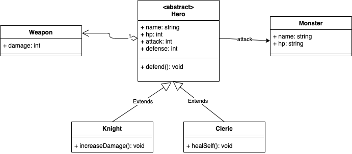

# Les diagrammes de classe

La phase de conception permet de se préparer au mieux au développement.
Parmi les tâches de cette phase est la définition des différents algorithmes, l'identification des données nécessaires au bon fonctionnement du projet, etc.
Dans ce chapitre, nous allons étudier un aspect important de la conception en POO: les diagrammes de classe.

Un diagramme de classe est tout dessin qui permet de représenter: les classes, les interfaces ainsi que leurs relations (héritage, implémentation, composition, agrégation). Il existe plusieurs façons de dessiner un diagramme, un des standard les plus connus sont les **diagrammes de classe UML**.

## Rappel des relations

-   Héritage: relation "est un"
-   Implémentation: nom de l'héritage pour les interfaces
-   Composition: A a une ou plusieurs instances de B et B est détruit si A est détruit (en d'autres termes B dépend A). Exemple: les chambres d'une maison.
-   Agrégation: A a une ou plusieurs instances de B et B n'est pas forcément détruit si A est détruit (en d'autres termes B ne dépend pas de A). Exemple: le moteur d'une voiture.

## Les diagrammes de classe UML

UML est une norme qui définit comment représenter différents types de diagrammes.
Parmi ces différents types de diagrammes, on trouve les diagrammes de classe.
[Cet aide-mémoire](https://khalilstemmler.com/articles/uml-cheatsheet/) permet de voir les grandes lignes.

## Exercices

Modéliser en UML les diagrammes de classe des cas suivants:

-   Une école
-   Un garage de mécanicien
-   Un jeu de combat en 1v1
-   Les exercices précédents

Une fois les diagrammes réalisés, coder en TS et créer quelques objets.

Vous pouvez-utiliser [diagrams.net](https://www.diagrams.net/) ou une de ses [extensions VSCode](https://marketplace.visualstudio.com/items?itemName=hediet.vscode-drawio)
