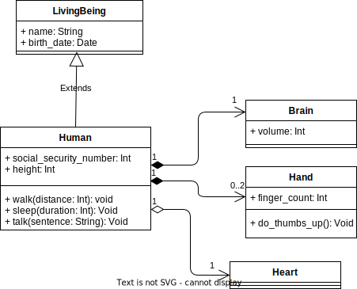
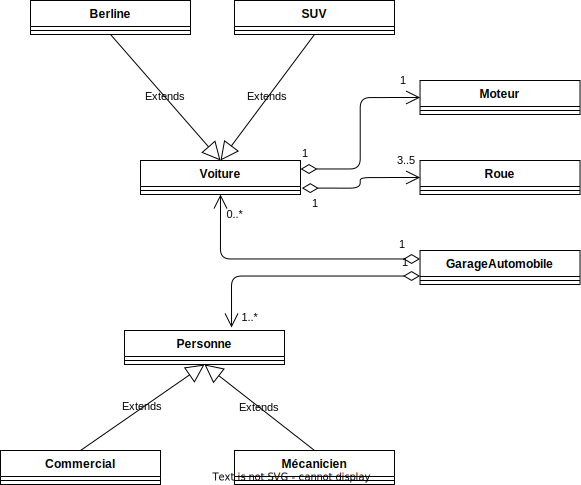

# Les diagrammes de classe

La phase de conception permet de se préparer au mieux au développement.
Parmi les tâches de cette phase est la définition des différents algorithmes, l'identification des données nécessaires au bon fonctionnement du projet, etc.
Dans ce chapitre, nous allons étudier un aspect important de la conception en POO: les diagrammes de classe.

Un diagramme de classe est tout dessin qui permet de représenter: les classes, les interfaces ainsi que leurs relations (héritage, implémentation, composition, agrégation). Il existe plusieurs façons de dessiner un diagramme, un des standard les plus connus sont les **diagrammes de classe UML**.

## Rappel des relations

- Héritage: relation "est un"
- Implémentation: nom de l'héritage pour les interfaces
- Composition: A a une ou plusieurs instances de B et B est détruit si A est détruit (en d'autres termes B dépend A). Exemple: les chambres d'une maison.
- Agrégation: A a une ou plusieurs instances de B et B n'est pas forcément détruit si A est détruit (en d'autres termes B ne dépend pas de A). Exemple: le moteur d'une voiture.
- Association:
    - Association unidirectionnelle: A peut appeler les méthodes et propriétés de B mais pas l'inverse
    - Association bidirectionnelle: A peut appeler les méthodes et propriétés de B et inversement
    - Association avec soi-même: A peut appeler les méthodes et propriétés de d'une autre instance de A

## Les diagrammes de classe UML

UML est une norme qui définit comment représenter différents types de diagrammes.
Parmi ces différents types de diagrammes, on trouve les diagrammes de classe.
[Cet aide-mémoire](https://khalilstemmler.com/articles/uml-cheatsheet/) permet de voir les grandes lignes.

## Exemple 1


## Exemple 2



Ce diagramme permet d'obtenir le code suivant:

??? "Code correspondant au diagramme de classe diagramme UML"

    ```py
        --8<--
        python/uml02.py
        --8<--
    ```

## Exercices

Pour dessiner les diagrammes UML, vous pouvez-utiliser [diagrams.net](https://www.diagrams.net/) ou [cette extension VSCode](https://marketplace.visualstudio.com/items?itemName=hediet.vscode-drawio).

### Exercice 1

Dessiner le diagramme de classes UML pour chacun groupe de classes (1 diagramme par cas):

- Meuble, Armoire, Table, Jardin, Chambre, Maison
- Pâtisserie, Mille-Feuilles, Pain, Farine, Sel, Sucre
- Voiture, Camion, Vélo, Roue, Moteur, Volant
- Voiture, Berline, SUV, Roue, Moteur, Personne, Commercial, Mécanicien, GarageAutomobile

Coder en python un des cas.

#### Solution du dernier cas



??? "Solution en Python"

    ```py
    --8<--
    python/exo_uml_garage.py
    --8<--
    ```

### Exercice 2

Soit le diagramme UML suivant:


Apporter les modifications suivantes au diagramme:

- L'être humain a un corps. Ce dernier a un cerveau, des mains et un coeur.
- Un animal est un être vivant qui a aussi un corps
- Une plante est un être vivant (qui n'a pas de corps)

### Exercice 3

Modéliser en UML les diagrammes de classe des cas suivants:

- Une école
- Un garage de mécanicien
- Un jeu de combat en 1v1
- Les exercices précédents

Une fois les diagrammes réalisés, coder en TS et créer quelques objets.

### Exercice 4

Développer une programme de gestion d’une médiathèque.
On doit pouvoir stocker différents types de médias : audio, vidéo, texte (comme un livre ou un journal).

- Les audio et vidéo peuvent être écoutés, le texte peut être lu et les vidéos peuvent être visualisées.
- Chaque objet d’un de ces médias doit avoir au minimum un nom, un format, une taille (en octets).
- On veut pouvoir trier les médias selon le nom ou la taille par ordre croissant ou décroissant.
- Un texte contient en plus une propriété "contenu" ainsi que deux méthodes supplémentaires, la première renvoie le nombre de consonnes du contenu, la deuxième le nombre de mots du contenu.

👉 Dessiner le diagramme de classes UML et coder les différentes classes.

👉 Instancier une médiathèque contenant deux audios, une vidéo et trois textes. Vous êtes libre de valoriser les propriétés à votre guise. Vous pouvez vous faire aider de certains sites si besoin ([générateur de texte](https://fr.lipsum.com/), [Générateur de nom de livre](https://blog.reedsy.com/book-title-generator/))

👉 Afficher la médias triés par nom par ordre croissant et par taille par ordre décroissant.

👉 Afficher le nombre de consonnes

- On souhaite aussi stocker stocker des textes audio qui sont des textes qu'on peut écouter.

👉 Dessiner le nouveau diagramme UML de classes UML et mettre à jour votre code en conséquence.

👉 Ajouter deux textes audio dans la médiathèque

On souhaite simuler l'interaction des humains avec la médiathèque. Chaque jour, une seule personne entre dans la médiathèque et ressort le même jour.
Chaque personne effectue une seule action puis ressort.
On suppose qu'il n'y a qu'une seule personne dans la médiathèque à la fois et peut effectuer une de ces actions **aléatoirement**:

- Soit louer un film. Un film loué sera rendu deux jours après,
- Soit écouter une vidéo, un audio ou texte audio,
- Soit louer un texte ou texte audio. Un texte loué sera rendu 4 jours après.

👉 Dessiner le diagramme de classes UML et coder les différentes classes.

👉 Ecrire un programme qui réalise cette simulation pendant 1 mois (30 jours).

👉 A la fin du mois, afficher des statistiques sur le nombre de films et textes loués ainsi que le nombre d'éléments écoutés.

Le propriétaire de la médiathèque permet de faire du CRUD (Create, Read, Update, Delete) sur la médiathèque.

👉 Dessiner le diagramme de classes UML et coder les différentes classes.

👉 Développer les différentes méthodes CRUD

👉 Effectuer ces actions via le propriétaire: ajouter une vidéo, afficher le contenu d'un texte, modifier un texte et supprimer un audio
